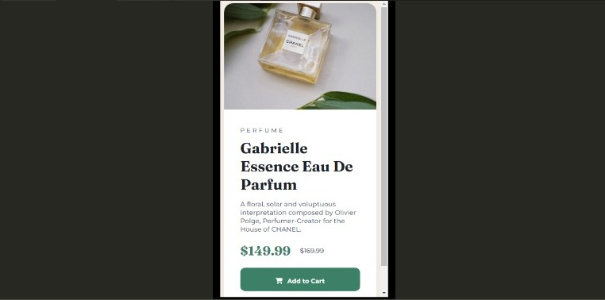

# Frontend Mentor - Product preview card component solution

This is a solution to the [Product preview card component challenge on Frontend Mentor](https://www.frontendmentor.io/challenges/product-preview-card-component-GO7UmttRfa). Frontend Mentor challenges help you improve your coding skills by building realistic projects. 

## Table of contents

- [Overview](#overview)
  - [Screenshot](#screenshot)
  - [Links](#links)
- [My process](#my-process)
  - [Built with](#built-with)
  - [Continued development](#continued-development)
- [Author](#author)

## Overview

### Screenshot

Desktop View.

Mobile View.

### Links

- Solution URL: [Frontend Mentor]()
- Live Site URL: [Netlify](https://product-preview-card-alex.netlify.app/)

## My process

I started by creating a section container to center the whole card, then continued with applying the styles to the background, image and texts. After that, I continued by applying a media query to make it responsive to smaller devices, such as phones and tablets.

### Built with

- Semantic HTML5 markup
- CSS custom properties
- Mobile-first workflow

### Continued development

Creating this product preview card and making it responsive, I think it will be useful in the future, as it may help developing product cards in any kind of e-commerce website. Also, the responsive media query could be used as a template in any other kind of card or container included in other kinds of websites

## Author

- GitHub - [@Alex-T23](https://github.com/Alex-T23)
- Frontend Mentor - [@Alex-T23](https://www.frontendmentor.io/profile/Alex-T23)
- Linkedin - [Alex de la Torre Neira](https://www.linkedin.com/in/alex-de-la-torre-neira-6b1bb620a/)
